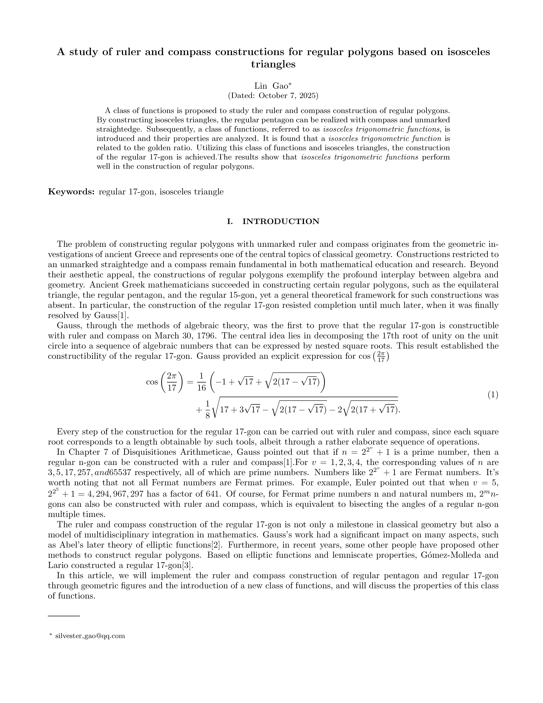

# A study of ruler and compass constructions for regular polygons based on isosceles triangles

Abstract
============
A class of functions is proposed to study the ruler and compass construction of regular polygons. By constructing isosceles triangles, the regular pentagon can be realized with compass and unmarked  straightedge. Subsequently, a class of functions, referred to as \textit{isosceles trigonometric functions}, is introduced and their properties are analyzed. It is found that a \textit{isosceles trigonometric function} is related to the golden ratio. Utilizing this class of functions and isosceles triangles, the construction of the regular 17-gon is achieved.The results show that \textit{isosceles trigonometric functions} perform well in the construction of regular polygons.

Usage Instructions
============

In conclusion, this study investigates the compass-and-straightedge constructions of regular polygons and yields several results. The main conclusions are as follows. 

First, the compass-and-straightedge constructions of the regular pentagon and the regular 17-gon are obtained  by constructing nested isosceles triangles. It's found that using isosceles triangles to solve this problem is visual and convenient. 

Second, a class of \textit{isosceles trigonometric functions} is defined and it is found that an isosceles trigonometric function is related to the golden ratio, that is, $sni \frac{\pi}{5} =\frac{\sqrt{5}-1}{2}$. Furthermore, some formulas of isosceles trigonometric functions are more convenient than trigonometric functions. We take the following formula as an example,

$$
csi\alpha+csi\beta=csi\frac{\alpha+\beta}{2}csi\frac{\alpha-\beta}{2}.
$$

Compared to the trigonometric function formula $\cos \alpha + \cos \beta = 2 \cos\frac{\alpha + \beta}{2} \cos\frac{\alpha - \beta}{2}$,
this formula does not have the factor 2, so it is more convenient when transforming from left to right or from right to left.

Third, by constructing nested isosceles triangles and using the isosceles trigonometric functions, the ruler and compass construction of the regular 17-gon has been successfully achieved. It is obtained that 

$$
csi(\frac{4\pi}{17})=\frac{1}{8}(-1+\sqrt{17}+\sqrt{34-2\sqrt{17}})+\frac{1}{4}\sqrt{{17+3\sqrt{17}-2\sqrt{34+2\sqrt{17}}-\sqrt{34-2\sqrt{17}}}},
$$

and

$$
sni(\frac{\pi}{17})=\frac{1}{8}(-1+\sqrt{17}+\sqrt{34-2\sqrt{17}})-\frac{1}{4}\sqrt{{17+3\sqrt{17}-2\sqrt{34+2\sqrt{17}}-\sqrt{34-2\sqrt{17}}}}.
$$

A regular 17-gon can be constructed with a straightedge and compass from $csi(\frac{4\pi}{17})$ or $sni(\frac{\pi}{17})$.

Finally,the Cauchy-Schwarz inequality of isosceles trigonometric functions, isosceles Euler's formula and some special definite integrals are discussed. We obtained some concise formulas, making it easier for us to directly apply these formulas in subsequent research. A set of formulas are as follows

$$
\sum_{k=0}^{n-1} csi(4\theta_k) = \sum_{k=0}^{n-1} sni(4\theta_k) =0, \quad
\sum_{k=0}^{n-1} sni (2\theta_k) csi (2\theta_k) = 0,
$$

where $\theta_k = \frac{2\pi k}{n}$ and  $n \in \mathbb{Z}$.

These results highlight the significance of regular polygons and isosceles trigonometric functions, and provide useful tools for further studies in geometry. 

    

    <i>An example of software parameters</i>

